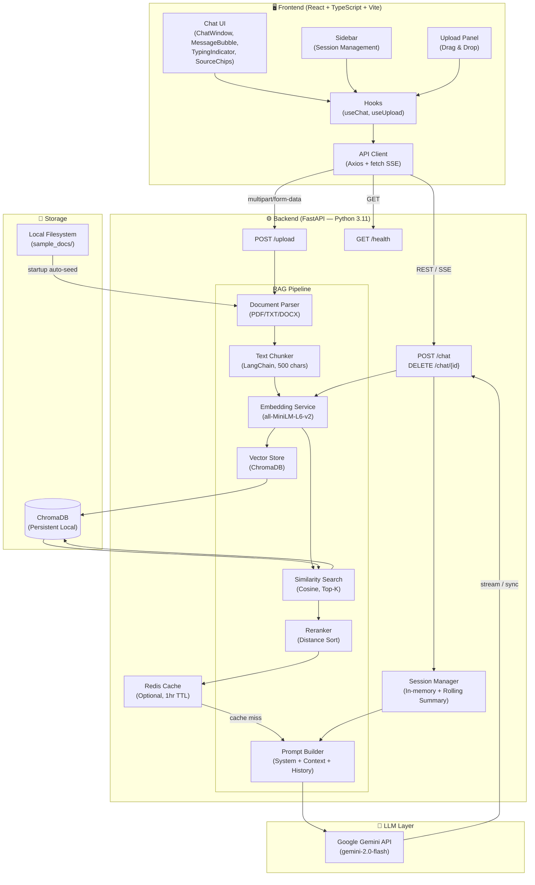
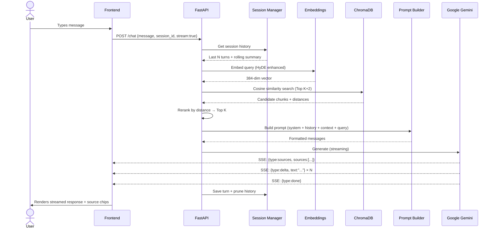
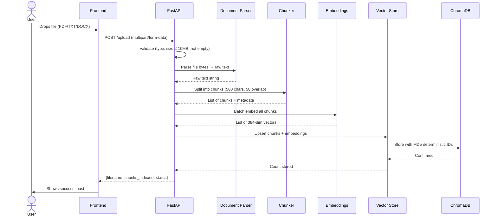

# Architecture Diagram — BankBot

## Full System Architecture

```mermaid
graph TB
    subgraph Frontend["🖥️ Frontend (React + TypeScript + Vite)"]
        UI["Chat UI\n(ChatWindow, MessageBubble,\nTypingIndicator, SourceChips)"]
        Sidebar["Sidebar\n(Session Management)"]
        Upload["Upload Panel\n(Drag & Drop)"]
        Hooks["Hooks\n(useChat, useUpload)"]
        APIClient["API Client\n(Axios + fetch SSE)"]
    end

    subgraph Backend["⚙️ Backend (FastAPI — Python 3.11)"]
        ChatRouter["POST /chat\nDELETE /chat/{id}"]
        UploadRouter["POST /upload"]
        HealthRouter["GET /health"]

        subgraph RAG["RAG Pipeline"]
            Parser["Document Parser\n(PDF/TXT/DOCX)"]
            Chunker["Text Chunker\n(LangChain, 500 chars)"]
            Embedder["Embedding Service\n(all-MiniLM-L6-v2)"]
            VectorStore["Vector Store\n(ChromaDB)"]
            Retriever["Similarity Search\n(Cosine, Top-K)"]
            Reranker["Reranker\n(Distance Sort)"]
            PromptBuilder["Prompt Builder\n(System + Context + History)"]
        end

        SessionMgr["Session Manager\n(In-memory + Rolling Summary)"]
        RedisCache["Redis Cache\n(Optional, 1hr TTL)"]
    end

    subgraph LLM["🤖 LLM Layer"]
        Gemini["Google Gemini API\n(gemini-2.0-flash)"]
    end

    subgraph Storage["💾 Storage"]
        ChromaDB[("ChromaDB\n(Persistent Local)")]
        LocalFS["Local Filesystem\n(sample_docs/)"]
    end

    %% Frontend internal
    UI --> Hooks
    Sidebar --> Hooks
    Upload --> Hooks
    Hooks --> APIClient

    %% Frontend to Backend
    APIClient -->|"REST / SSE"| ChatRouter
    APIClient -->|"multipart/form-data"| UploadRouter
    APIClient -->|"GET"| HealthRouter

    %% Upload flow
    UploadRouter --> Parser
    Parser --> Chunker
    Chunker --> Embedder
    Embedder --> VectorStore
    VectorStore --> ChromaDB

    %% Query flow
    ChatRouter --> SessionMgr
    ChatRouter --> Embedder
    Embedder --> Retriever
    Retriever --> ChromaDB
    ChromaDB --> Retriever
    Retriever --> Reranker
    Reranker --> RedisCache
    RedisCache -->|"cache miss"| PromptBuilder
    SessionMgr --> PromptBuilder
    PromptBuilder --> Gemini
    Gemini -->|"stream / sync"| ChatRouter

    %% Auto-seed
    LocalFS -->|"startup auto-seed"| Parser
```

---

## RAG Query Flow

```mermaid
sequenceDiagram
    actor User
    participant FE as Frontend
    participant API as FastAPI
    participant SM as Session Manager
    participant EMB as Embeddings
    participant DB as ChromaDB
    participant PB as Prompt Builder
    participant LLM as Google Gemini

    User->>FE: Types message
    FE->>API: POST /chat {message, session_id, stream:true}
    API->>SM: Get session history
    SM-->>API: Last N turns + rolling summary
    API->>EMB: Embed query (HyDE enhanced)
    EMB-->>API: 384-dim vector
    API->>DB: Cosine similarity search (Top K+2)
    DB-->>API: Candidate chunks + distances
    API->>API: Rerank by distance → Top K
    API->>PB: Build prompt (system + history + context + query)
    PB-->>API: Formatted messages
    API->>LLM: Generate (streaming)
    LLM-->>FE: SSE: {type:sources, sources:[...]}
    LLM-->>FE: SSE: {type:delta, text:"..."}  × N
    LLM-->>FE: SSE: {type:done}
    API->>SM: Save turn + prune history
    FE->>User: Renders streamed response + source chips
```

---

## Document Ingestion Flow

```mermaid
sequenceDiagram
    actor User
    participant FE as Frontend
    participant API as FastAPI
    participant P as Document Parser
    participant C as Chunker
    participant E as Embeddings
    participant VS as Vector Store
    participant DB as ChromaDB

    User->>FE: Drops file (PDF/TXT/DOCX)
    FE->>API: POST /upload (multipart/form-data)
    API->>API: Validate (type, size ≤ 10MB, not empty)
    API->>P: Parse file bytes → raw text
    P-->>API: Raw text string
    API->>C: Split into chunks (500 chars, 50 overlap)
    C-->>API: List of chunks + metadata
    API->>E: Batch embed all chunks
    E-->>API: List of 384-dim vectors
    API->>VS: Upsert chunks + embeddings
    VS->>DB: Store with MD5 deterministic IDs
    DB-->>VS: Confirmed
    VS-->>API: Count stored
    API-->>FE: {filename, chunks_indexed, status}
    FE->>User: Shows success toast
```
